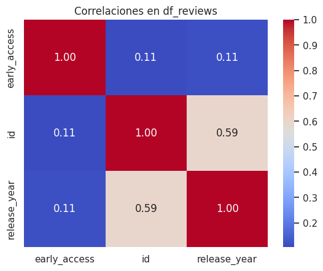

# MLOPS_ALLAN_ALVAREZ

# Proyecto Individual N°1 HENRY LABS

Este proyecto consiste en crear un sistema de recomendación de videojuegos para usuarios de Steam, utilizando los datos proporcionados por HENRY. El proyecto abarca todas las fases del ciclo de vida de un proyecto de Machine Learning, desde la preparación de los datos hasta el despliegue de la API.

## Datos

Los datos empleados para este proyecto se encuentran en tres archivos JSON con una estructura anidada:

- australian_user_reviews.json: contiene las reseñas de los usuarios sobre los juegos que han jugado.
- australian_users_items.json: contiene la información de los usuarios, los juegos que poseen y las horas que han jugado.
- output_steam_games.json: contiene la información de los juegos disponibles en Steam, como el nombre, el género, el precio, etc.

Los datos se pueden descargar desde el siguiente enlace: [https://drive.google.com/drive/folders/1tRLbXi9pPaJM8nscWxKuRlOrArL5Z66q?usp=sharing](^13^).

## Análisis Exploratorio de Datos (EDA)

En esta sección, exploraremos a fondo los datos proporcionados para obtener insights valiosos y comprender mejor la naturaleza del conjunto de datos. A continuación, se presenta un resumen de los pasos clave realizados durante el EDA:

1. **Carga de Datos:**
   - Se cargaron los datos desde el archivo JSON principal.

2. **Exploracion:** - Se llevaron a cabo diversas operaciones para abordar visualizar valores nulos, duplicados y cualquier anomalía en los datos.

3. **Visualización de Datos:**
   - Se utilizaron gráficos y visualizaciones para explorar las distribuciones, relaciones y tendencias en los datos.
   

4. **Conclusiones Preliminares:**
   - Se resumen las observaciones clave y posibles patrones identificados durante el EDA.
   - Se concluyo que existe una gran cantidad de valor faltantes, nulos y que no representan datos de valor en la toma de decisiones pues estan dispuestos para la limpieza y transformacion.

Estos pasos proporcionan una base sólida para comprender la naturaleza de los datos y orientarán las decisiones futuras en el proyecto. Consulta las secciones correspondientes para obtener detalles más profundos sobre cada etapa del EDA.

## ETL (Extract, Transform, Load)

En esta etapa, se realizó el proceso de ETL para extraer, transformar y cargar los datos en un formato adecuado para el análisis y el modelado. El proceso involucró las siguientes tareas:

- Desanidar las columnas que contenían listas o diccionarios, como reviews o genres.
- Normalizar el formato de las fechas al estándar AAAA-MM-DD.
- Identificar y corregir o eliminar los valores duplicados, nulos o incorrectos.
- Seleccionar las columnas relevantes para el sistema de recomendación y los endpoints de la API.
- Aplicar análisis de sentimiento a las reseñas de los usuarios usando la librería (textblob) y crear una nueva columna llamada sentiment_analysis con valores 0 (negativo), 1 (neutral) o 2 (positivo).

Como resultado del proceso de ETL, se obtuvieron tres archivos CSV: steam_games.csv, user_reviews.csv y user_items.csv. Estos archivos se pueden encontrar en la carpeta ETL del repositorio en DRIVE.

## Data Science

En esta etapa, se realizó el análisis exploratorio de los datos y se implementó el sistema de recomendación basado en la similitud del coseno. El proceso involucró las siguientes tareas:

- Explorar las características y distribuciones de los datos, como el número de usuarios, juegos, reseñas, géneros, precios, etc.
- Crear una matriz de similitud del coseno entre los juegos, usando las columnas de genres, sentiment_analysis y price.
- Definir una función que recibe el nombre de un juego y devuelve una lista de los 10 juegos más similares, según la matriz de similitud.
- Evaluar el rendimiento del sistema de recomendación usando un mapa de calor que muestra la similitud entre el juego consultado y los juegos recomendados.

El código y los resultados del análisis y el modelado se pueden ver en el archivo ML.ipynb de la carpeta src del repositorio.

## API con FastAPI

Para acceder a la funcionalidad del sistema de recomendación, se ha implementado una API usando el framework FastAPI. La API permite realizar las siguientes consultas:

developer(Valve):

Retorno: Un diccionario con la información sobre la cantidad de items y el porcentaje de contenido gratuito por año según la empresa desarrolladora.
userdata(greenfuzzie23):

Retorno: Un diccionario con información sobre el usuario, incluyendo el dinero gastado, el porcentaje de recomendación basado en reviews.recommend, y la cantidad de items.
UserForGenre(Adventure):

Retorno: Un diccionario con el usuario que acumula más horas jugadas para el género dado y una lista de acumulación de horas jugadas por año de lanzamiento.
best_developer_year(2010):

Retorno: Una lista con el top 3 de desarrolladores con los juegos MÁS recomendados por usuarios para el año dado.
developer_reviews_analysis(Valve):

Retorno: Un diccionario con el nombre del desarrollador como clave y una lista con la cantidad total de registros de reseñas de usuarios categorizados con análisis de sentimiento positivo o negativo.

recomendacion_juego(Gun Range VR):

Retorno: Un diccionario o lista con 5 juegos recomendados similares al juego identificado por el producto_id. Estos juegos son seleccionados en función de la similitud con el juego ingresado.

recomendacion_usuario(greenfuzzie23):

Retorno: Un diccionario o lista con 5 juegos recomendados para el usuario identificado por el usuario_id. Estas recomendaciones se generan basándose en el historial o preferencias del usuario.

La API se puede probar en la siguiente URL: [https://api-functions.onrender.com](^17^)

## Despliegue en Render

Para desplegar la API en la nube, se ha utilizado el servicio de Render. El despliegue se ha realizado siguiendo los siguientes pasos:

- Crear una cuenta en Render y vincularla con el repositorio de github.
- Crear un archivo requirements.txt con las dependencias necesarias para ejecutar la API.
- Crear un archivo render.yaml con la configuración del servicio, como el tipo, el nombre, el comando, el puerto, etc.
- Hacer push del código al repositorio y esperar a que Render lo detecte y lo despliegue automáticamente.

La URL del servicio desplegado es la siguiente: [https://api-functions.onrender.com/docs].

## Instrucciones de uso

Para usar el sistema de recomendación, se puede acceder a la API desde el navegador o desde una aplicación como Postman. Los endpoints disponibles son los siguientes:

## Uso de la API

La API proporciona diversas funciones para analizar datos relacionados con juegos y usuarios. A continuación, se describen las funciones disponibles junto con ejemplos de cómo utilizarlas:

- **Obtener Información del Usuario:**
  - **Endpoint:** `/userdata/User_id`
  - **Método:** GET
  - **Descripción:** Obtén información detallada sobre un usuario, incluyendo la cantidad de dinero gastado, el porcentaje de recomendación según las reviews, y la cantidad de items.
  - **Ejemplo de Uso:** `GET /userdata/us213ndjss09sdf`
  - **Respuesta Esperada:**
    
    - Usuario: "us213ndjss09sdf"
    - Dinero Gastado: "200 USD"
    - % de Recomendación: "20%"
    - Cantidad de Items: 5

Estas funciones te permitirán explorar y analizar datos relevantes para tu proyecto. ¡No dudes en experimentar con diferentes parámetros y ajustar las consultas según tus necesidades específicas!
## Contacto

Si tienes alguna duda, sugerencia o comentario sobre este proyecto, puedes contactarme en el siguiente correo: elganador.inversionista1987@gmail.com

Espero que te haya gustado y que te sirva. 😊

